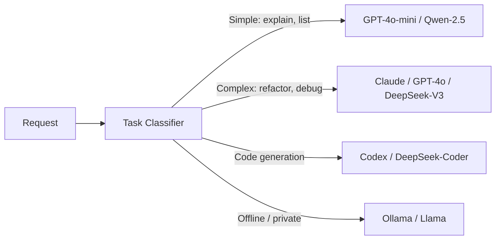
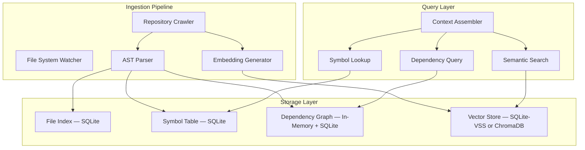
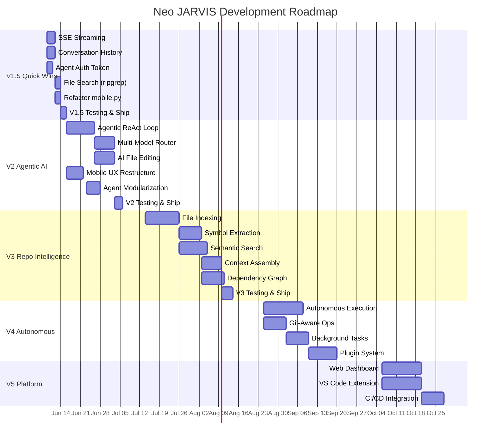

# Neo JARVIS — Complete Architectural Review & Evolution Strategy

> **Produced after deep analysis of:** `src/jarvis/` (17 modules), `agent-installer/jarvis_agent.py`, `Frontend/` (10 screens, 3 libs), `freellmapi/`, Docker configs, and all API routes.

---

## 1. Architecture Review

### 1.1 Current Architecture Diagram

```mermaid
graph TB
    subgraph "Mobile App (React Native/Expo)"
        MA[10 Tab Screens]
        API_TS[api.ts — 1031 LOC]
        CFG_TS[config.ts]
    end

    subgraph "Backend (FastAPI / Python)"
        MAIN[main.py — FastAPI]
        MW[Middleware: Auth + Rate Limit]
        subgraph "API Layer (18 route files)"
            MOB[mobile.py — 1452 LOC]
            AGT_WS[agent_ws.py — WebSocket relay]
            PAIR[pairing.py]
            CHAT[chat.py]
            IDE_R[ide.py]
            WF_R[workflows.py]
        end
        subgraph "Agent Core"
            LOOP[AgentLoop — OODA pattern]
            PLAN[Planner — LLM + simple fallback]
            EXEC[Executor — retry/self-heal]
        end
        subgraph "Tools (13 built-in)"
            SHELL[shell / paired_shell]
            FILE[file / paired_fs]
            GIT[git]
            VSCODE[vscode]
            DOCKER[docker]
            PROC[process]
            SYS[system]
        end
        subgraph "AI Layer"
            AI_SVC[ai_service.py — fallback chain]
            OLLAMA[OllamaClient]
            COPILOT[CopilotCLI + CopilotAPI]
            FREELLM[FreeLLMClient]
        end
        subgraph "Support Systems"
            MEM[Memory: short-term + long-term]
            WF[Workflows: engine/parser/triggers]
            SH[Self-Heal: monitors + resolvers]
            DEV[Devices: registry/distributor]
            IDE_M[IDE Manager: VS Code + Cursor]
            OBS[Observability: metrics/tracing/dashboard]
            SEC[Security: policy/audit/session]
            EVT[Events: Kafka client]
        end
    end

    subgraph "Desktop Agent (jarvis_agent.py)"
        DA[JarvisAgent — 656 LOC]
        DA_WS[WebSocket client]
        DA_EXEC[Shell executor]
        DA_FS[File R/W + directory list]
        DA_TEL[Telemetry reporter]
    end

    MA -->|HTTP/REST| MAIN
    MA -->|Pairing code| AGT_WS
    AGT_WS -->|WebSocket relay| DA_WS
    MAIN --> MOB
    MAIN --> LOOP
    LOOP --> PLAN
    LOOP --> EXEC
    EXEC --> SHELL
    EXEC --> FILE
    AI_SVC --> OLLAMA
    AI_SVC --> COPILOT
    AI_SVC --> FREELLM
    LOOP --> MEM
    LOOP --> SH
    LOOP --> DEV
```



### 1.2 Strengths

| Area | Details |
|------|---------|
| **Unique Mobile-First UX** | No competitor offers a native mobile app that pairs to dev machines. This is a genuine differentiator. |
| **Solid Agent Architecture** | OODA loop pattern in [loop.py](file:///c:/Users/7CIN/Desktop/Neo--DevPilot-Agent/Neo--DevPilot-Agent/src/jarvis/agent/loop.py) with plan→approve→execute→learn is architecturally sound. |
| **Multi-Provider AI Fallback** | [ai_service.py](file:///c:/Users/7CIN/Desktop/Neo--DevPilot-Agent/Neo--DevPilot-Agent/src/jarvis/llm/ai_service.py) gracefully cascades across FreeLLM → Copilot → Ollama with OOM handling. |
| **Self-Healing Engine** | [engine.py](file:///c:/Users/7CIN/Desktop/Neo--DevPilot-Agent/Neo--DevPilot-Agent/src/jarvis/self_heal/engine.py) with 4 monitors + 4 resolvers is mature for this stage. |
| **Multi-Device Orchestration** | [DeviceRegistry](file:///c:/Users/7CIN/Desktop/Neo--DevPilot-Agent/Neo--DevPilot-Agent/src/jarvis/devices/registry.py) with capability detection, heartbeat, and load-based selection is well-designed. |
| **Tool System** | Clean `BaseTool` → `ToolRegistry` → `ToolResult` abstraction allows easy extension. |
| **IDE Abstraction** | [IDEManager](file:///c:/Users/7CIN/Desktop/Neo--DevPilot-Agent/Neo--DevPilot-Agent/src/jarvis/ide/manager.py) with adapter pattern supporting VS Code + Cursor. |
| **Workflow Engine** | Full YAML-driven workflow system with triggers, persistence, and run history. |
| **Security Policy** | [policy.py](file:///c:/Users/7CIN/Desktop/Neo--DevPilot-Agent/Neo--DevPilot-Agent/src/jarvis/security/policy.py) with capability-scoped command assessment and destructive-pattern blocking. |
| **Pairing System** | Simple 6-char code pairing is elegant for mobile→laptop binding. |

### 1.3 Weaknesses

| Area | Severity | Details |
|------|----------|---------|
| **No Code Understanding** | 🔴 Critical | Zero repository indexing, AST parsing, symbol resolution, or semantic search. The system is blind to codebase structure. |
| **AI is Chat-Only** | 🔴 Critical | `generate_chat()` is a single-turn text-in/text-out function. No tool-calling, no function-calling, no multi-turn agent reasoning. The LLM cannot invoke tools autonomously. |
| **Planner is Fragile** | 🟠 High | [Planner](file:///c:/Users/7CIN/Desktop/Neo--DevPilot-Agent/Neo--DevPilot-Agent/src/jarvis/agent/planner.py) parses LLM output as raw JSON with regex extraction. No structured output, no retry on malformed JSON, no validation against tool schemas. |
| **Desktop Agent is Thin** | 🟠 High | [jarvis_agent.py](file:///c:/Users/7CIN/Desktop/Neo--DevPilot-Agent/Neo--DevPilot-Agent/agent-installer/jarvis_agent.py) is a single 656-line file with no sandboxing, no command allowlisting, no auth beyond pairing code. |
| **mobile.py is Monolithic** | 🟠 High | [mobile.py](file:///c:/Users/7CIN/Desktop/Neo--DevPilot-Agent/Neo--DevPilot-Agent/src/jarvis/api/v1/mobile.py) at 1452 LOC is a "god module" mixing AI, file ops, git, system info, copilot models. |
| **No Streaming** | 🟡 Medium | All AI responses are full-response. No SSE/streaming for progressive output. Users wait 10-30s with no feedback. |
| **Memory Requires Infra** | 🟡 Medium | Long-term memory needs PostgreSQL + embeddings. Short-term needs Redis. Neither are available in typical dev setups. |
| **Events Module Unused** | 🟡 Medium | Kafka client in [events/](file:///c:/Users/7CIN/Desktop/Neo--DevPilot-Agent/Neo--DevPilot-Agent/src/jarvis/events) is defined but never wired into the application lifecycle. |
| **No Tests Running** | 🟡 Medium | Test files exist at root level but `tests/` directory is empty. No CI/CD pipeline. |
| **Observability is Scaffolded** | 🟡 Medium | Metrics, tracing, dashboard modules exist but are not connected to actual monitoring backends. |

### 1.4 Risks

| Risk | Impact | Probability |
|------|--------|-------------|
| **Security breach via desktop agent** — No auth on WS commands, arbitrary shell execution | Catastrophic | High |
| **Single point of failure** — Backend crash kills all device communication | High | Medium |
| **AI quality ceiling** — Without code context, AI responses are generic and low-value | High | Certain |
| **Scaling wall** — In-memory singletons (device registry, workflow engine, memory) don't survive restarts | Medium | High |
| **WebSocket relay bottleneck** — All agent↔mobile traffic routes through central server | Medium | Medium |

### 1.5 Technical Debt

1. **Duplicate code**: `detect_language()`, `detect_project_type()`, and file helpers are duplicated across `mobile.py`, `jarvis_agent.py`, and tools
2. **Global mutable state**: 7+ module-level singletons with `_instance = None` pattern
3. **Mixed async/sync**: Some paths block the event loop (subprocess calls in device detection)
4. **`asyncio` import at bottom of file** in [workflows/engine.py](file:///c:/Users/7CIN/Desktop/Neo--DevPilot-Agent/Neo--DevPilot-Agent/src/jarvis/workflows/engine.py#L397)
5. **No database migrations**: PostgreSQL schema is assumed, not managed
6. **Hardcoded paths**: Desktop agent has `C:\Users\7CIN` in error messages

---

## 2. Gap Analysis: Current → Vision

### 🔴 Critical Gaps (Blocks product viability)

| Gap | Current | Required | Effort |
|-----|---------|----------|--------|
| **Code Context / Repository Intelligence** | None | File indexing, symbol extraction, dependency graphs, semantic search | 4-6 weeks |
| **Agentic AI (Tool-Calling Loop)** | Single-turn chat | Multi-turn agent with tool invocation, observation, reflection | 3-4 weeks |
| **Streaming Responses** | Full-response only | SSE/WebSocket streaming from LLM to mobile | 1-2 weeks |
| **Desktop Agent Security** | Pairing code only | Token auth, command allowlisting, capability scoping, audit log | 2-3 weeks |
| **Persistent State** | In-memory singletons | SQLite (local) / PostgreSQL (cloud) with migrations | 1-2 weeks |

### 🟠 Important Gaps (Limits competitive position)

| Gap | Current | Required | Effort |
|-----|---------|----------|--------|
| **Multi-Model Routing** | Linear fallback chain | Task-based routing (fast models for simple, strong for complex) | 2-3 weeks |
| **File Editing from AI** | Manual copy-paste | AI generates diffs, user approves, agent applies | 2-3 weeks |
| **Conversation History** | No persistence | Session-based chat with context window management | 1-2 weeks |
| **Error Recovery with Context** | Self-heal is generic | Error → search memory → apply known fix → verify | 2-3 weeks |
| **Web Dashboard** | None | Browser-based UI for desktop users | 3-4 weeks |
| **Plugin/Extension System** | Hardcoded tools | Dynamic tool loading, user-created tools | 2-3 weeks |

### 🟢 Nice-to-Have (Differentiators)

| Gap | Details | Effort |
|-----|---------|--------|
| **Voice Commands** | Speech-to-text on mobile for hands-free coding | 1-2 weeks |
| **CI/CD Integration** | Watch GitHub Actions/pipelines, report failures | 1-2 weeks |
| **Team Collaboration** | Multiple users share a device fleet | 3-4 weeks |
| **Custom Workflows Marketplace** | Share/import workflow templates | 2-3 weeks |
| **Browser Extension** | GitHub PR review, documentation lookup | 3-4 weeks |

---

## 3. Product Roadmap

### V1.5 — Quick Wins (1-2 weeks)

> Ship in days. Maximum user-perceived value for minimum engineering effort.

| Feature | Impact | Effort | Details |
|---------|--------|--------|---------|
| **SSE Streaming for AI** | 🔴 High | 2-3 days | Add `/project/ai/ask-stream` endpoint. Mobile shows tokens as they arrive. |
| **Conversation Memory** | 🔴 High | 2-3 days | Store chat history in SQLite. Send last N messages as context. |
| **Desktop Agent Auth Token** | 🟠 Med | 1-2 days | HMAC-signed session token on pairing. Reject unsigned WebSocket messages. |
| **Refactor mobile.py** | 🟡 Low | 1-2 days | Split into `ai_routes.py`, `file_routes.py`, `git_routes.py`, `system_routes.py`. |
| **Basic File Search** | 🟠 Med | 1-2 days | `grep`/`ripgrep` tool for searching across project files. |
| **Command History UI** | 🟡 Low | 1 day | Show last 20 commands with re-run button on mobile. |

---

### V2 — Major Improvements (3-6 weeks)

> Transform Neo from a remote shell into an AI development companion.

#### V2.1 — Agentic AI Loop

Replace single-turn `generate_chat()` with a proper ReAct agent loop:

```
User Intent → LLM (with tools as functions) → Tool Call → Observation → LLM → ... → Final Answer
```

- LLM calls tools via function-calling / structured output
- Executor runs tools, returns observations
- Loop continues until LLM emits final answer or hits step limit
- Mobile shows each step in real-time via streaming

#### V2.2 — Multi-Model Router



- Classify by: task complexity, privacy requirements, latency budget
- Route to optimal model
- Fall back on failure

#### V2.3 — AI-Powered File Editing

- AI generates unified diffs
- Mobile shows before/after with syntax highlighting
- User approves → agent applies via `paired_write_file`
- Auto-backup before every write

#### V2.4 — Desktop Agent Hardening

- Signed command protocol (HMAC-SHA256)
- Per-session capability grants (shell, read_fs, write_fs, git, network)
- Command blocklist expanded with regex patterns
- Structured audit log with rotation
- Auto-update mechanism

---

### V3 — Repository Intelligence (6-10 weeks)

> Neo understands your codebase deeply — the single biggest leap toward competing with Cursor/Antigravity.

*(Full design in Section 4)*

- **File Index**: Crawl repository, build file tree with metadata
- **Symbol Extraction**: Parse ASTs for functions, classes, imports
- **Dependency Graph**: Map file→file and symbol→symbol dependencies
- **Semantic Search**: Embed code chunks, enable natural-language queries
- **Smart Context Assembly**: For any AI request, auto-retrieve the 5-10 most relevant code chunks

---

### V4 — Agent Workflows & Autonomous Execution (10-14 weeks)

> Neo can execute multi-step development tasks with minimal supervision.

- **Task Decomposition**: "Add dark mode to the settings page" → plan of 8 steps
- **Autonomous Execution Mode**: Execute plans with checkpoints, rollback on failure
- **Git-Aware Operations**: Branch before changes, commit with meaningful messages, PR creation
- **Test-Driven Feedback**: Run tests after changes, auto-fix if tests fail
- **Background Tasks**: Long-running tasks (builds, deployments) with push notifications
- **Approval Workflows**: Mobile notification → approve/reject individual steps

---

### V5 — Advanced Development Platform (14-20 weeks)

> Competitive with leading AI development tools.

- **Web Dashboard**: Full browser-based UI matching mobile capabilities
- **Multi-Repo Support**: Manage multiple projects, switch context
- **Team Features**: Shared device pools, role-based access, activity feed
- **Plugin Marketplace**: Community-contributed tools, workflows, AI prompts
- **CI/CD Integration**: GitHub Actions, GitLab CI monitoring and trigger
- **Knowledge Base**: Per-project learnings, coding patterns, architectural decisions
- **VS Code / Cursor Extension**: Deep IDE integration beyond CLI launches

---

## 4. Repository Intelligence Design

### 4.1 Architecture



### 4.2 Scaling Strategy

| Repo Size | Strategy | Token Budget | Index Time |
|-----------|----------|-------------|------------|
| **≤100 files** | Full index in memory, embed all files | ~50K tokens context | <5s |
| **100-1,000 files** | SQLite index, selective embedding (source only, skip node_modules/vendor), chunk by function | ~20K token budget per query | 10-30s |
| **1,000-10,000 files** | Incremental indexing (git diff), tiered embedding (hot files full, cold files summary-only), LRU cache for vectors | ~10K token budget per query | 30-120s initial, <5s incremental |
| **10,000+ files** | Lazy indexing on demand, monorepo-aware (only index relevant packages), compressed symbol table, background indexing | ~8K token budget per query | Background, minutes |

### 4.3 File Index Schema

```sql
CREATE TABLE file_index (
    path TEXT PRIMARY KEY,
    relative_path TEXT NOT NULL,
    language TEXT,
    size_bytes INTEGER,
    line_count INTEGER,
    last_modified REAL,
    content_hash TEXT,         -- SHA-256 for change detection
    is_source BOOLEAN,         -- vs config/asset/generated
    importance_score REAL,     -- 0-1, based on import count + recency
    summary TEXT,              -- 1-2 sentence AI summary (lazy)
    indexed_at REAL
);

CREATE TABLE symbols (
    id INTEGER PRIMARY KEY,
    file_path TEXT REFERENCES file_index(path),
    name TEXT NOT NULL,
    kind TEXT NOT NULL,         -- function, class, method, variable, import
    line_start INTEGER,
    line_end INTEGER,
    signature TEXT,             -- e.g., "def execute(self, params: dict) -> ToolResult"
    docstring TEXT,
    parent_symbol_id INTEGER,  -- for methods within classes
    exported BOOLEAN DEFAULT TRUE
);

CREATE TABLE dependencies (
    source_path TEXT REFERENCES file_index(path),
    target_path TEXT REFERENCES file_index(path),
    dep_type TEXT,             -- import, extends, implements, uses
    symbol_name TEXT,
    PRIMARY KEY (source_path, target_path, symbol_name)
);

CREATE TABLE embeddings (
    chunk_id TEXT PRIMARY KEY,
    file_path TEXT REFERENCES file_index(path),
    chunk_type TEXT,           -- file_summary, function, class, block
    content TEXT,
    line_start INTEGER,
    line_end INTEGER,
    embedding BLOB,            -- float32 vector
    token_count INTEGER
);
```

### 4.4 AST Parsers (Language Support)

| Language | Parser | Maturity |
|----------|--------|----------|
| Python | `ast` stdlib | V3.0 |
| TypeScript/JavaScript | `tree-sitter-javascript` via `tree-sitter` Python bindings | V3.0 |
| Go | `tree-sitter-go` | V3.1 |
| Rust | `tree-sitter-rust` | V3.1 |
| Java | `tree-sitter-java` | V3.2 |
| Fallback (any language) | Regex-based function/class extraction | V3.0 |

### 4.5 Context Assembly Algorithm

```python
async def assemble_context(query: str, repo_index: RepoIndex, token_budget: int = 8000) -> str:
    """Smart context assembly for any AI request."""
    context_parts = []
    remaining_tokens = token_budget

    # 1. File tree overview (always include, ~200 tokens)
    tree = repo_index.get_file_tree(max_depth=3)
    context_parts.append(f"## Project Structure\n{tree}")
    remaining_tokens -= estimate_tokens(tree)

    # 2. Semantic search for relevant code chunks (~60% of budget)
    semantic_budget = int(remaining_tokens * 0.6)
    chunks = await repo_index.semantic_search(query, token_budget=semantic_budget)
    for chunk in chunks:
        context_parts.append(f"## {chunk.file_path} (L{chunk.line_start}-{chunk.line_end})\n```{chunk.language}\n{chunk.content}\n```")
    remaining_tokens -= sum(estimate_tokens(c.content) for c in chunks)

    # 3. Symbol-based context (dependencies of found chunks, ~25% of budget)
    symbol_budget = int(remaining_tokens * 0.6)
    related_symbols = repo_index.get_related_symbols(chunks, budget=symbol_budget)
    for sym in related_symbols:
        context_parts.append(f"## {sym.file_path}:{sym.name}\n```\n{sym.signature}\n```")

    # 4. Recent git changes (if relevant, ~15% of budget)
    if any(word in query.lower() for word in ["recent", "changed", "diff", "bug"]):
        recent = repo_index.get_recent_changes(limit=5)
        context_parts.append(f"## Recent Changes\n{recent}")

    return "\n\n".join(context_parts)
```

### 4.6 Embedding Strategy

- **Model**: Use Ollama's `nomic-embed-text` (already configured) for local, OpenAI `text-embedding-3-small` for cloud
- **Chunking**: Split by function/class boundaries (AST-aware), not arbitrary line counts
- **Storage**: SQLite with `sqlite-vss` extension for local vector search (zero infrastructure)
- **Dimensions**: 768 (nomic) or 1536 (OpenAI)
- **Update**: Incremental — only re-embed files with changed `content_hash`

---

## 5. AI Architecture Design

### 5.1 Model Routing Matrix

| Task Type | Primary | Fallback | Max Tokens | Latency Target |
|-----------|---------|----------|------------|----------------|
| **Chat / Q&A** | FreeLLM (GPT-4o-mini) | Ollama (llama3.2:1b) | 2K | <3s |
| **Code Explanation** | FreeLLM (GPT-4o) | Copilot CLI | 4K | <5s |
| **Code Generation** | FreeLLM (Claude Sonnet) | DeepSeek-Coder-V3 | 8K | <10s |
| **Complex Refactoring** | FreeLLM (Claude Opus) | GPT-4o | 16K | <30s |
| **Planning / Architecture** | Claude Opus / GPT-4o | DeepSeek-V3 | 8K | <15s |
| **Code Review** | GPT-4o / Claude Sonnet | Qwen-2.5-Coder | 8K | <10s |
| **Git Commit Messages** | GPT-4o-mini | Ollama (any) | 512 | <2s |
| **Offline / Private** | Ollama (configurable) | — | Model limit | Variable |

### 5.2 Task Classifier

```python
class TaskClassifier:
    """Classify user intent to select optimal model and parameters."""

    SIMPLE_PATTERNS = ["explain", "what is", "list", "show", "status", "help"]
    CODE_GEN_PATTERNS = ["write", "create", "generate", "implement", "add"]
    COMPLEX_PATTERNS = ["refactor", "architect", "design", "migrate", "optimize"]
    REVIEW_PATTERNS = ["review", "check", "audit", "find bugs", "improve"]

    def classify(self, intent: str, context: dict) -> TaskRoute:
        lower = intent.lower()

        if any(p in lower for p in self.SIMPLE_PATTERNS):
            return TaskRoute(tier="fast", max_tokens=2048, stream=True)

        if any(p in lower for p in self.COMPLEX_PATTERNS):
            return TaskRoute(tier="strong", max_tokens=16384, stream=True)

        if any(p in lower for p in self.CODE_GEN_PATTERNS):
            return TaskRoute(tier="code", max_tokens=8192, stream=True)

        if any(p in lower for p in self.REVIEW_PATTERNS):
            return TaskRoute(tier="review", max_tokens=8192, stream=True)

        # Default to medium
        return TaskRoute(tier="medium", max_tokens=4096, stream=True)
```

### 5.3 Provider Configuration

```python
# Recommended provider setup for ~/.jarvis/providers.json
{
    "providers": {
        "freellm": {
            "api_key": "...",
            "base_url": "https://api.freellm.com/v1",
            "models": {
                "fast": "gpt-4o-mini",
                "medium": "gpt-4o",
                "strong": "claude-sonnet-4",
                "code": "deepseek-coder-v3"
            }
        },
        "ollama": {
            "host": "http://localhost:11434",
            "models": {
                "fast": "llama3.2:1b",
                "medium": "llama3.2:3b",
                "code": "deepseek-coder:6.7b",
                "embedding": "nomic-embed-text"
            }
        },
        "openai": {
            "api_key": "...",
            "models": {"fast": "gpt-4o-mini", "strong": "gpt-4o"}
        },
        "anthropic": {
            "api_key": "...",
            "models": {"strong": "claude-sonnet-4", "strongest": "claude-opus-4"}
        }
    },
    "routing": {
        "default_provider": "freellm",
        "offline_provider": "ollama",
        "cost_limit_daily_usd": 5.0
    }
}
```

### 5.4 Cost Optimization

- **Token counting**: Track usage per provider per day
- **Caching**: Cache identical prompts with same context hash (LRU, 1000 entries)
- **Context compression**: Summarize large code blocks before sending to LLM
- **Tiered models**: Use cheapest model that can handle the task
- **Daily budget alerts**: Warn at 80%, hard-stop at 100% of daily limit

### 5.5 Fallback Strategy

```
Request → Primary Provider
    ├── Success → Return
    ├── Rate Limited → Wait + Retry (1x) → Fallback Provider
    ├── Timeout (>30s) → Fallback Provider
    ├── Auth Error → Skip Provider, try next
    └── OOM (Ollama) → Try smaller model → Try next provider
```

---

## 6. Desktop Agent Evolution

### 6.1 Current State Assessment

[jarvis_agent.py](file:///c:/Users/7CIN/Desktop/Neo--DevPilot-Agent/Neo--DevPilot-Agent/agent-installer/jarvis_agent.py) is a **656-line monolith** that handles:
- WebSocket connection management
- Shell command execution (no sandboxing)
- File read/write (minimal path validation)
- Directory listing
- Project info detection
- Telemetry reporting

### 6.2 Evolution Plan

#### Phase 1: Security Hardening (V1.5)

```python
# Add to jarvis_agent.py
class SecureAgent(JarvisAgent):
    def __init__(self):
        super().__init__()
        self.session_token = None          # Set during pairing
        self.capabilities = frozenset()     # Granted by user
        self.command_log = AuditLog()       # All commands logged
        self.blocked_patterns = load_blocklist()

    async def handle_message(self, msg):
        data = json.loads(msg)
        # 1. Verify HMAC signature
        if not self._verify_signature(data):
            await self._send_error("Invalid signature")
            return
        # 2. Check capability
        if not self._has_capability(data["type"]):
            await self._send_error("Capability not granted")
            return
        # 3. Log command
        self.command_log.record(data)
        # 4. Execute
        await super().handle_message(msg)
```

#### Phase 2: Modularization (V2)

```
agent-installer/
├── jarvis_agent/
│   ├── __init__.py
│   ├── agent.py           # Main agent class
│   ├── connection.py       # WebSocket management + reconnection
│   ├── executor.py         # Command execution with sandboxing
│   ├── filesystem.py       # File operations with path validation
│   ├── security.py         # Auth, capabilities, audit
│   ├── telemetry.py        # System metrics collection
│   ├── updater.py          # Self-update mechanism
│   └── config.py           # Configuration management
├── install.bat
├── install.sh
└── requirements.txt
```

#### Phase 3: Plugin Architecture (V4)

```python
class AgentPlugin:
    """Base class for agent plugins."""
    name: str
    capabilities_required: list[str]

    async def handle(self, data: dict) -> dict:
        raise NotImplementedError

# Example: Git plugin
class GitPlugin(AgentPlugin):
    name = "git"
    capabilities_required = ["git"]

    async def handle(self, data: dict) -> dict:
        action = data.get("action")
        if action == "status":
            return await self._git_status(data.get("path", "."))
        elif action == "diff":
            return await self._git_diff(data.get("path", "."))
        # ...
```

#### Phase 4: Background Execution (V4)

- Run as Windows Service / systemd unit
- Tray icon with status indicator
- Auto-start on boot (opt-in)
- System resource monitoring and throttling

---

## 7. User Experience Review

### 7.1 Mobile UX

**Current (10 tabs):** index, commands, files, ide, mission, tasks, analytics, devices, settings, `_layout`

| Issue | Severity | Recommendation |
|-------|----------|----------------|
| **Too many tabs** | 🟠 High | Consolidate to 4: **Home** (chat + quick actions), **Files** (browser + editor), **Devices** (pairing + status), **Settings** |
| **No streaming feedback** | 🔴 Critical | AI responses appear after 10-30s of nothing. Add streaming + typing indicator. |
| **No onboarding flow** | 🟠 High | First-time users see empty screens. Add guided setup: server URL → pair laptop → first command. |
| **Chat is buried** | 🔴 Critical | The primary AI interaction (chat) should be the **default tab**, not hidden behind commands. |
| **No syntax highlighting** | 🟡 Medium | File viewer shows plain text. Add syntax highlighting for code files. |
| **No offline mode** | 🟡 Medium | App is useless without server connection. Show cached data, queue commands. |
| **No dark/light theme toggle** | 🟡 Medium | Currently hardcoded dark theme. Some users prefer light mode. |
| **No pull-to-refresh** | 🟡 Medium | Users can't manually refresh system status or file listings. |

### 7.2 Desktop UX

**Current:** Terminal-based agent with printed pairing code. No GUI.

| Recommendation | Priority | Details |
|----------------|----------|---------|
| **System tray icon** | 🟠 High | Show connection status, pairing code on hover. Right-click for menu. |
| **Status dashboard** | 🟡 Medium | Simple localhost web page showing agent status, recent commands, resource usage. |
| **Notification support** | 🟡 Medium | Desktop notifications for incoming commands, approval requests. |

### 7.3 Web UX

**Current:** None exists.

| Recommendation | Priority | Details |
|----------------|----------|---------|
| **Web dashboard (V5)** | 🟡 Later | React/Next.js web app mirroring mobile capabilities. Useful for desktop-only users. |
| **Progressive Web App** | 🟡 Later | PWA version of web dashboard for cross-platform access without app install. |

### 7.4 Recommended Tab Restructure

```
Tab 1: 💬 Chat (DEFAULT)
  - AI chat with streaming
  - Quick action buttons (git status, run tests, etc.)
  - Recent command history

Tab 2: 📁 Files
  - File browser with breadcrumbs
  - File viewer with syntax highlighting
  - AI-powered file editing

Tab 3: 💻 Devices
  - Pairing management
  - Device status dashboard
  - System telemetry

Tab 4: ⚙️ Settings
  - Server configuration
  - AI provider management
  - Theme, preferences
```

---

## 8. Competitive Analysis

### Cursor

| Dimension | Cursor | Neo JARVIS |
|-----------|--------|------------|
| **Code Understanding** | Deep — AST, symbols, full codebase indexing | ❌ None |
| **AI Quality** | Excellent — custom fine-tuned models + Claude/GPT | Basic — single-turn chat |
| **IDE Integration** | Native — IS the IDE | External — launches VS Code/Cursor via CLI |
| **Multi-Device** | ❌ Desktop only | ✅ Mobile + desktop + multi-laptop |
| **Mobile** | ❌ None | ✅ Native app |
| **Pricing** | $20/month | Free (open source) |
| **Adopt**: Codebase indexing, inline edit suggestions, tab-completion UX concepts |
| **Avoid**: Being an IDE — Neo should complement IDEs, not replace them |

### Antigravity (Google)

| Dimension | Antigravity | Neo JARVIS |
|-----------|------------|------------|
| **Agent Capabilities** | Full — multi-tool agentic loops, browser control, image generation | Basic — plan→execute only |
| **Planning** | Sophisticated — implementation plans, task tracking | Simple — LLM JSON parsing |
| **Context** | Massive — knowledge items, semantic search, file indexing | None |
| **Platform** | IDE-integrated | Mobile-first |
| **Adopt**: Planning mode (plan → review → execute → verify), knowledge items system, tool orchestration |
| **Avoid**: Complexity level — Antigravity has 50+ tools. Neo should start focused. |

### Windsurf

| Dimension | Windsurf | Neo JARVIS |
|-----------|----------|------------|
| **Flows** | Cascade — proactive multi-file edits | Reactive — user initiates everything |
| **Context** | Full codebase awareness | None |
| **Autonomy** | High — can edit multiple files proactively | Low — single tool calls |
| **Adopt**: Proactive suggestions ("I noticed this file has a bug..."), multi-file edit workflow |
| **Avoid**: Over-autonomy without user control — users report Windsurf making unwanted changes |

### Claude Code (Anthropic)

| Dimension | Claude Code | Neo JARVIS |
|-----------|------------|------------|
| **Terminal Agent** | Excellent — runs in terminal with full shell access | Desktop agent is thin |
| **Tool Use** | Native function calling with Claude | No function calling |
| **Safety** | Permission system, command approval | Basic blocklist |
| **Adopt**: Permission/approval UX, git-aware context, compact terminal agent |
| **Avoid**: Terminal-only UX — Neo's mobile advantage is the differentiator |

### Devin (Cognition)

| Dimension | Devin | Neo JARVIS |
|-----------|-------|------------|
| **Autonomy** | Highest — fully autonomous task completion | Low — user drives each step |
| **Planning** | Multi-step with checkpoints and rollback | Single plan, linear execution |
| **Environment** | Sandboxed VM per task | Direct machine access |
| **Adopt**: Task decomposition, checkpoint/rollback, progress reporting |
| **Avoid**: Full autonomy without guardrails. Devin's accuracy issues show the risk. |

### OpenHands

| Dimension | OpenHands | Neo JARVIS |
|-----------|-----------|------------|
| **Open Source** | Yes | Yes |
| **Agent Framework** | Mature — CodeAct agent with sandbox | Basic — OODA loop scaffolded |
| **Sandbox** | Docker-based isolated execution | None |
| **Adopt**: Sandboxed execution model, open-source community patterns |
| **Avoid**: Docker dependency for every operation — too heavy for mobile use case |

### What Neo Already Does Better Than ALL Competitors

1. **📱 Mobile-first development companion** — Nobody else has this
2. **🔗 Multi-laptop pairing** — Work from phone across multiple machines
3. **🔄 AI provider flexibility** — Use any model, switch freely
4. **💰 Cost** — Open source, bring your own keys
5. **🏗️ Self-healing** — Automatic environment repair

---

## 9. Execution Plan with Scoring

### Scoring Criteria

- **Impact** (1-10): User value delivered
- **Effort** (1-10): Engineering days/complexity (lower = easier)
- **Business Value** (1-10): Competitive positioning + retention
- **Priority Score** = (Impact × 2 + Business Value × 1.5) / Effort

### Ranked Feature Backlog

| # | Feature | Impact | Effort | Biz Value | Score | Phase | Depends On |
|---|---------|--------|--------|-----------|-------|-------|------------|
| 1 | SSE Streaming for AI | 9 | 3 | 8 | 10.0 | V1.5 | — |
| 2 | Conversation History (SQLite) | 8 | 3 | 7 | 8.8 | V1.5 | — |
| 3 | Desktop Agent Auth | 7 | 3 | 9 | 9.2 | V1.5 | — |
| 4 | Refactor mobile.py | 4 | 2 | 3 | 6.3 | V1.5 | — |
| 5 | File/Code Search (ripgrep) | 7 | 2 | 6 | 11.5 | V1.5 | — |
| 6 | Agentic AI Loop (ReAct) | 10 | 7 | 10 | 5.0 | V2 | #1, #2 |
| 7 | Multi-Model Router | 8 | 5 | 8 | 5.6 | V2 | #6 |
| 8 | AI File Editing + Diff View | 9 | 5 | 9 | 6.3 | V2 | #6 |
| 9 | Mobile UX Restructure (4 tabs) | 7 | 4 | 7 | 6.1 | V2 | — |
| 10 | Desktop Agent Modularization | 5 | 4 | 5 | 4.4 | V2 | #3 |
| 11 | File Indexing + Symbol Extraction | 10 | 8 | 10 | 5.0 | V3 | — |
| 12 | Semantic Search (Embeddings) | 9 | 6 | 10 | 5.5 | V3 | #11 |
| 13 | Smart Context Assembly | 10 | 5 | 10 | 7.0 | V3 | #11, #12 |
| 14 | Dependency Graph | 7 | 6 | 7 | 4.1 | V3 | #11 |
| 15 | Autonomous Task Execution | 9 | 8 | 9 | 4.4 | V4 | #6, #13 |
| 16 | Git-Aware Operations | 8 | 5 | 8 | 5.6 | V4 | #6 |
| 17 | Background Tasks + Notifications | 7 | 5 | 7 | 4.9 | V4 | #6 |
| 18 | Plugin/Extension System | 7 | 6 | 8 | 4.3 | V4 | #10 |
| 19 | Web Dashboard | 7 | 8 | 7 | 3.6 | V5 | — |
| 20 | CI/CD Integration | 6 | 5 | 7 | 4.5 | V5 | #6 |
| 21 | Team Collaboration | 6 | 8 | 8 | 3.0 | V5 | #19 |
| 22 | VS Code Extension | 8 | 8 | 9 | 4.1 | V5 | #11 |

### Development Order



---

## 10. Final Recommendation: CTO/Founder Roadmap

### If I Were CTO and Founder of Neo…

---

### 30 Days — "Make It Work Brilliantly"

**Goal:** Transform Neo from "interesting side project" into "daily driver I can't live without."

| Week | Focus | Deliverables |
|------|-------|-------------|
| **Week 1** | AI Experience | SSE streaming, conversation history with SQLite, file/code search via ripgrep |
| **Week 2** | Security & Polish | Desktop agent HMAC auth, refactor mobile.py, fix duplicate code |
| **Week 3** | Agentic Foundation | ReAct agent loop with function calling. LLM can now invoke tools. |
| **Week 4** | UX Overhaul | Restructure mobile to 4 tabs with chat as default. Onboarding flow. |

**Why this order:**
- Streaming alone changes user perception from "slow and broken" to "fast and alive"
- Agent auth is a launch-blocker for any serious user
- The agentic loop is the single most impactful architectural change
- UX restructure amplifies everything built in weeks 1-3

**Exit criteria:** A developer can pair their phone, ask "find all TODO comments in my project", and watch the agent search files, display results, and let them navigate to each one — all streaming in real-time.

---

### 90 Days — "Understand My Code"

**Goal:** Neo becomes the first AI coding tool that understands your codebase from your phone.

| Month | Focus | Deliverables |
|-------|-------|-------------|
| **Month 2** | Multi-Model + Editing | Task classifier, model routing, AI-powered file editing with diff view, desktop agent modularization |
| **Month 3** | Repository Intelligence | File indexing, AST symbol extraction, embedding-based semantic search, smart context assembly |

**Why this order:**
- Multi-model routing makes AI responses dramatically better (right model for right task)
- File editing transforms Neo from "read-only viewer" to "actual development tool"
- Repo intelligence is the big technical moat — once users see AI with code context vs without, they'll never go back

**Exit criteria:** A developer asks "how does the authentication middleware work?" and Neo retrieves the relevant files, shows the code, and explains it with full context — all from their phone.

---

### 6 Months — "My AI Dev Partner"

**Goal:** Neo handles multi-step development tasks autonomously.

| Quarter | Focus | Deliverables |
|---------|-------|-------------|
| **Q3** | Autonomous Agent | Task decomposition, checkpoint/rollback, git-aware operations, background tasks with push notifications, approval workflows on mobile |
| **Q3** | Plugin System | Dynamic tool loading, community tool format, agent plugin architecture |

**Why this timeline:**
- Autonomy requires the trust infrastructure (auth, approval, rollback) built in months 1-3
- Repo intelligence from month 3 is prerequisite for meaningful autonomous changes
- Plugin system enables community contributions, reducing core team burden

**Exit criteria:** A developer says "add input validation to the user registration endpoint, write tests, and create a PR" — and Neo does it across multiple files with a single approval.

---

### 12 Months — "The Platform"

**Goal:** Neo is a competitive, multi-platform AI development workspace.

| Half | Focus | Deliverables |
|------|-------|-------------|
| **H2** | Platform Expansion | Web dashboard, VS Code/Cursor extension, CI/CD integration, team features, knowledge base per project |
| **H2** | Commercial | Usage analytics, subscription tiers, enterprise features (SSO, audit logs, compliance) |

**Why:**
- Web dashboard captures the desktop-only developer segment
- IDE extensions create deep integration beyond CLI launches
- Team features are the path to B2B revenue
- By month 12, Neo should be generating revenue or have clear path to it

**Exit criteria:** A 5-person engineering team uses Neo daily across mobile, web, and IDE. They manage 3 repos, run CI/CD from their phones, and the team lead reviews PRs from a tablet.

---

### The One Thing I'd Stake Everything On

> **Repository Intelligence (V3) is the make-or-break feature.**

Every competitor does chat. Every competitor does code completion. What none of them do is give you **deep codebase understanding from your phone, connected to any machine, using any AI model you choose**.

That's Neo's unique combination: **Mobile × Multi-device × Code Understanding × Model Freedom**.

Build the repo intelligence right, and Neo becomes indispensable. Without it, Neo is a fancy remote terminal.

---

> [!IMPORTANT]
> **Immediate next steps for your review:**
> 1. Approve the V1.5 scope (streaming, conversation history, agent auth, search, mobile.py refactor)
> 2. Decide on model routing strategy (FreeLLM-primary vs bring-your-own-key)
> 3. Confirm mobile UX restructure direction (4 tabs with chat-first)
> 4. Approve repo intelligence storage choice (SQLite-local vs PostgreSQL)
